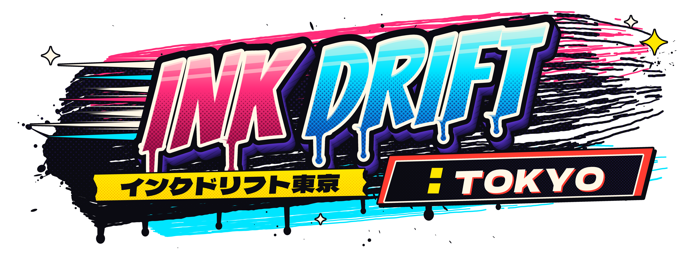
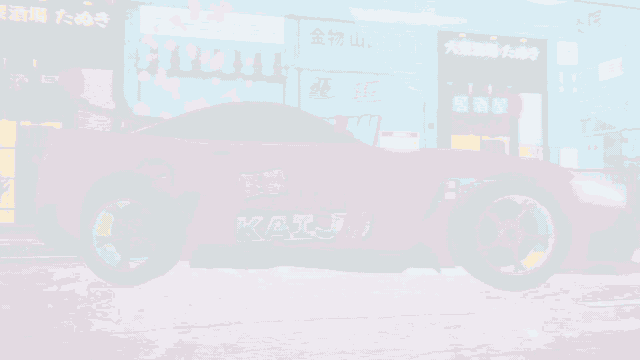
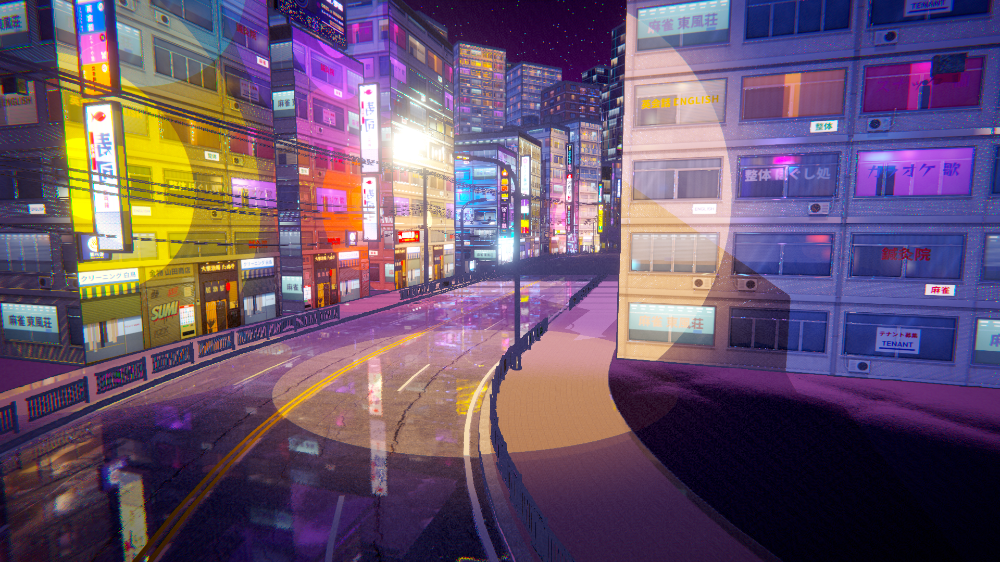
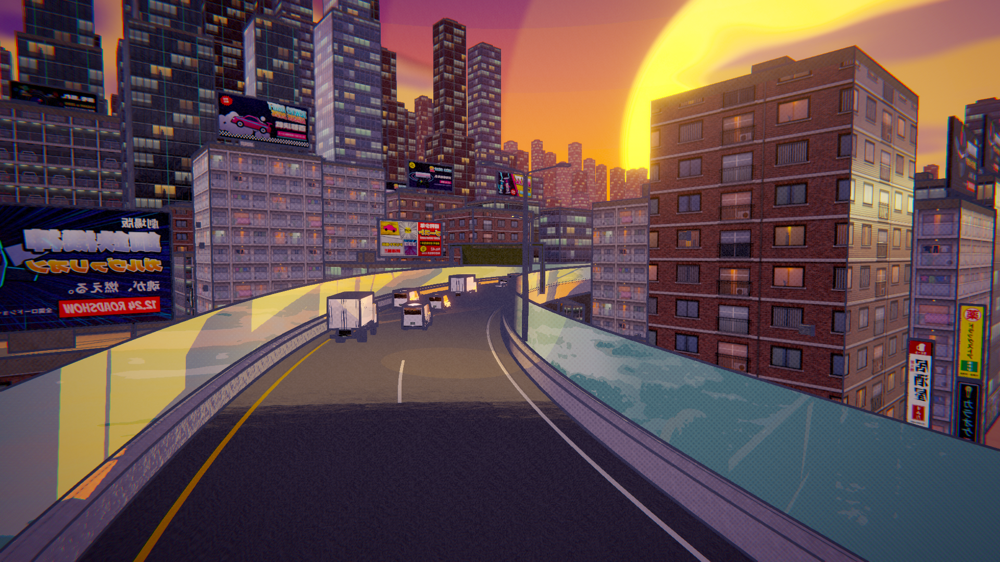
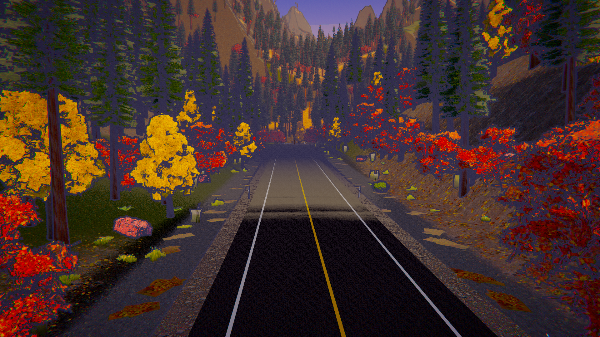

<p align="center"></p>

<p align="center"><b>A comic-book cel-shaded drift racer through Tokyo.</b><br>
Neon canyons, elevated expressways and autumn mountain passes — rendered like a manga panel, driven like a sim.</p>

<p align="center">
<a href="../../releases/latest"><b>⬇ Download for macOS · Windows · Linux</b></a> ·
<a href="#give-this-to-your-agent"><b>Install with your agent</b></a> ·
<a href="https://github.com/gazhenko/ink-drift-tokyo/releases/download/v1.0.0/INK-DRIFT-TOKYO-trailer.mp4"><b>▶ Watch the trailer</b></a>
</p>

<p align="center"><a href="https://github.com/gazhenko/ink-drift-tokyo/releases/download/v1.0.0/INK-DRIFT-TOKYO-trailer.mp4"></a></p>

| SHIBUYA NEON · 渋谷ネオン | SHUTO C1 LOOP · 首都高C1 | OKUTAMA TOUGE · 奥多摩峠 |
|---|---|---|
|  |  |  |

---

## What it is

**INK DRIFT: TOKYO** is a playable demo built in Unity 6 (URP). Every pixel goes through a custom toon pipeline —
banded light, screen-space ink outlines, halftone screentone in the shadows, aggressive color grading — on top of
PBR-textured, densely dressed environments. Drifting is physical and hard: rear tires have to be *broken loose*
with weight transfer, handbrake or a clutch kick, then balanced with throttle and counter-steer.

Pop a good drift and Tokyo shouts at you: graffiti comic callouts burst onto the screen — **ナイス！ 成功！
グレートドリフト！ すごい！ やばい！！ 完璧！ 神ドリフト！！** — with a Japanese announcer voice.

### Features
- **3 tracks**
  - **SHIBUYA NEON 渋谷ネオン** — night, rain-soaked streets with real-time planar reflections of the neon, 90° intersections with side streets, a sakura-lined canal.
  - **SHUTO C1 LOOP 首都高C1** — elevated expressway at sunset over a dense city, sweepers, a sodium-lit tunnel, live traffic for near-misses.
  - **OKUTAMA TOUGE 奥多摩峠** — western Tokyo's mountain pass in autumn: stacked switchback hairpins, cedar forest, burning momiji, a river gorge.
- **5 cars** — fictional look-alikes of current Japanese sports cars with loud "ricer" kits (GT wings, splitters, canards, livery):
  HACHI GR8 · KAIJU SPR-X · ZENKAI Z · RAIJIN BX-R (AWD) · TSUBAME RS. 8 paints each.
- **Drift physics** — raycast suspension with anti-roll bars, combined-slip tire model (wheelspin eats lateral grip → real
  power oversteer), two-inertia clutch (clutch kicks work), locked drift diff, turbo spool + blow-off, rev limiter, auto/manual gearbox.
  Three assist levels from PRO (none) to EASY.
- **Drift scoring** — angle × speed × combo multiplier; multiplier grows with sustained drifts and direction switches;
  wall-proximity "CLOSE!" bonus; touch a wall and the chain is lost (失敗…).
- **Modes** — Drift Attack (score), Rival Battle (5 AI rivals who drift too), Free Run.
- **In-car view** — a right-hand-drive cockpit for every car, sized to that car's own windshield and roof: deep-dish
  wheel, live tach / boost / water gauges, shift lights, H-pattern shifter, hydraulic handbrake, bucket seats, roll cage
  and a working rear-view mirror. The driver is a fully rigged human model: anatomically correct arms and hands
  (MakeHuman CC0 base) in a quilted race suit and leather gloves made from photo-scanned CC0 leather, suede and
  fabric, with twin-needle stitching along every seam, holding a modelled deep-dish drift wheel. The whole cockpit is rendered with the same physically based shading, real shadows and baked ambient
  occlusion, and the comic ink filter stays off everything inside the car. The hands hold a real
  9-and-3 grip and steer hand over hand, and the left hand works the modelled H-pattern shifter (round knob, stitched
  leather boot) and hydraulic handbrake.
  The camera leans with g-forces and looks into the slide.
- **Procedural engine audio** per car (boxer rumble, inline-six scream, V6 growl), turbo whistle, blow-off flutter, pops & bangs;
  original synthesized eurobeat/city-pop soundtrack. The announcer is Japanese TTS (regenerate with ElevenLabs via
  `Tools/audio/elevenlabs_voices.py`).
- Keyboard and controller (Xbox, PlayStation, Switch Pro, generic pads and wheels), fully remappable.

## Controls

Every control can be remapped in **Settings ▸ Controls**, or from the pause menu during a race. Each control gets two
keys and one controller input. On-screen prompts follow the device you're using and show your controller's own button
names (A/B/X/Y, ×/○/□/△ or B/A/Y/X).

| | Keyboard | Xbox | PlayStation | Switch Pro |
|---|---|---|---|---|
| Throttle / Brake | W / S (or ↑ / ↓) | RT / LT | R2 / L2 | ZR / ZL |
| Steer | A / D (or ← / →) | Left stick | Left stick | Left stick |
| Handbrake | Space | A | × | B |
| Clutch (kick!) | Left Shift | X | □ | Y |
| Shift up / down (manual) | E / Q | RB / LB | R1 / L1 | R / L |
| Camera (chase · near · in-car · roof · bumper) | C | Y | △ | X |
| Look back | B | RS click | R3 | RS click |
| Reset car | R | View | Create / Share | − |
| Pause | Esc / P | Menu | Options | + |

### Controllers

- **Recognised directly:** Xbox 360 / One / Series and any XInput pad, DualShock 4, DualSense and Switch Pro, over USB or Bluetooth.
- **Everything else:** generic USB/Bluetooth pads that Unity only sees as a joystick (DirectInput-mode pads,
  unrecognised Linux pads, cheap Xbox-style clones) are turned into a standard gamepad automatically, using the common
  button layout. If any buttons come out wrong, open **Settings ▸ Controls ▸ Set up controller**. It asks you to press
  each button and move each stick once, then remembers that controller. Racing wheels work the same way: map the wheel
  to *left stick right* and the pedals to the triggers.
- **Options:** stick dead zone, steering response (linear / smooth / soft), vibration, and button labels (auto,
  Xbox, PlayStation, Nintendo). The **Input test** panel in the Controls screen shows live steering, pedal and button
  input.
- Pulling the controller during a race pauses the game.
- If a controller still isn't detected, look for the `[Input]` lines in `Player.log`. They list every controller the
  game saw and how it was mapped. `Player.log` is in `~/Library/Logs/Gazhenko/INK DRIFT TOKYO/` on macOS,
  `%USERPROFILE%\AppData\LocalLow\Gazhenko\INK DRIFT TOKYO\` on Windows and `~/.config/unity3d/Gazhenko/INK DRIFT TOKYO/` on Linux.

**Drifting 101:** brake into the corner to load the nose → flick or tap the handbrake → throttle to keep the rear
spinning → counter-steer and *steer where you want the car to go* → modulate throttle to hold the angle.
Clutch-kick (hold the clutch with throttle, release) to snap the rear loose mid-corner.

## Installation

### Give this to your agent

Paste this into Claude Code, Codex, Cursor or any other coding agent that can run commands on your computer:

```text
Install INK DRIFT: TOKYO v1.27.0 on this computer from its official GitHub release, then tell me how to start it.

Release: https://github.com/gazhenko/ink-drift-tokyo/releases/tag/v1.27.0
Download each file from https://github.com/gazhenko/ink-drift-tokyo/releases/download/v1.27.0/<file>
  macOS, Apple Silicon or Intel  InkDriftTokyo-v1.27.0-macOS-universal.zip  contains "INK DRIFT TOKYO.app"
  Windows 10/11, x64             InkDriftTokyo-v1.27.0-Windows-x64.zip      files at the zip root; the game is InkDriftTokyo.exe
  Linux, x64                     InkDriftTokyo-v1.27.0-Linux-x64.tar.gz     files at the archive root; the game is InkDriftTokyo.x86_64
  Checksums                      SHA256SUMS.txt

1. Detect the OS and CPU. If this computer is not one of the three platforms above (for example Windows or Linux on ARM), stop and tell me.
2. Check there are at least 2 GB free. Download the matching archive (about 600 MB) and SHA256SUMS.txt into a temporary folder with curl -L (curl.exe on Windows).
3. Compute the archive's SHA-256 and compare it with its line in SHA256SUMS.txt. If it does not match, delete the download and stop.
4. Install it, replacing any earlier INK DRIFT TOKYO install at the same location:
   - macOS: run ditto -x -k <archive> ~/Applications so the app ends up at "~/Applications/INK DRIFT TOKYO.app". The build is ad-hoc signed and not notarized; if the app carries a com.apple.quarantine attribute, remove it with xattr -dr com.apple.quarantine on the app.
   - Windows: create %LOCALAPPDATA%\Programs\InkDriftTokyo and extract into it (the zip has no top-level folder). Keep InkDriftTokyo.exe, UnityPlayer.dll, InkDriftTokyo_Data, MonoBleedingEdge and D3D12 together. Add a Start menu shortcut named "INK DRIFT TOKYO" that points at InkDriftTokyo.exe.
   - Linux: create ~/Games/InkDriftTokyo and extract into it (the archive has no top-level folder). Run chmod +x InkDriftTokyo.x86_64 and add ~/.local/share/applications/ink-drift-tokyo.desktop that launches it. The game needs Vulkan or OpenGL 4.5 drivers.
5. Delete the downloaded archive and SHA256SUMS.txt.
6. Do not change system-wide security settings (Gatekeeper, SmartScreen, antivirus), and do not run anything else from the archive. Do not launch the game unless I ask. Finish by telling me where it is installed and how to start it.
```

### Manual install

Download the archive for your computer from the [latest release](../../releases/latest). Check it against `SHA256SUMS.txt` if you like (`shasum -a 256`, `sha256sum` or PowerShell `Get-FileHash`).

- **macOS** (Apple Silicon + Intel): unzip, right-click `INK DRIFT TOKYO.app` → Open (the build is unsigned).
  If macOS says it's damaged: `xattr -dr com.apple.quarantine "INK DRIFT TOKYO.app"`.
- **Windows** (x64): extract the zip into a new folder and run `InkDriftTokyo.exe`.
- **Linux** (x64): extract into a new folder with `tar -xzf InkDriftTokyo-v1.27.0-Linux-x64.tar.gz`, then
  `chmod +x InkDriftTokyo.x86_64 && ./InkDriftTokyo.x86_64` (Vulkan or OpenGL 4.5).

The Windows and Linux archives have no top-level folder, so extract them into an empty folder of their own.

## Building from source
Requirements: Unity **6000.3.25f1** (6.3 LTS) with Windows/Linux build support, Blender 5.2 (only to regenerate models), Python 3.12+.

```bash
Tools/pipeline.sh setup     # configure URP, input, quality, layers
Tools/pipeline.sh content   # import → prefabs → resources → generate the 3 track scenes + menu
Tools/pipeline.sh build     # macOS / Windows / Linux players into Builds/
```
Everything in the world is generated from code: `Game/Assets/InkDrift/Scripts/Editor/Track/*` builds the tracks from
`Tools/tracks/layouts.json`; props and foliage are built in Blender by `Tools/blender/**`; textures/signs/callouts by
`Tools/art/**`.

## Tech notes
- URP Forward+, custom HLSL toon shader (`InkDrift/Toon`) with banded main + additional lights, screen-space halftone,
  banded reflections, rim light, wind, vertex AO; full-screen ink outline pass (depth + normals); custom sky, water and terrain shaders.
- GPU-instanced foliage renderer (thousands of cedars with LODs), procedural city blocks with sign atlases, real-time planar reflections.
- Trailer captured in-engine by `TrailerDirector` (fixed-timestep frame capture + `AudioRenderer`) and cut with ffmpeg.

## Credits
All third-party assets are CC0 / OFL — see [CREDITS.md](CREDITS.md). The five hero cars and four traffic vehicles are
original procedural models built in Blender for this project (fictional look-alikes; no manufacturer names, badges or
logos). All brands, shops and billboards in the game are fictional.

Code: MIT (see [LICENSE](LICENSE)).
